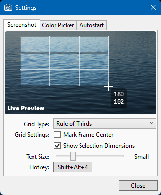
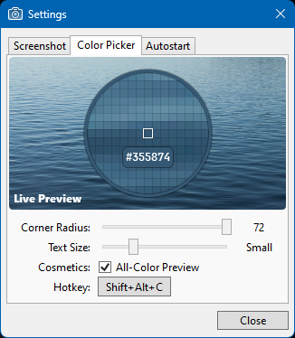

# DeadEye

## What's this?

DeadEye is an opinionated fast screenshot tool with a cheesy name modeled after macOS's own. It's still a work in progress, but it's perfectly usable.

## What is this not?

This is not a fully-featured screenshot app with features such as drawing, highlighting, or uploading to an image host. If that's what you want, check out [ShareX](https://getsharex.com/) instead.

## Why?

In Windows 10 Version 2004, Microsoft broke the built-in Win+Shift+S screenshot tool.
Prior to that update, pressing this key combination would *immediately* take a screenshot and present the area selection UI.
Now, there's a delay of roughly half a second between keypress and the actual screenshot, making it impossible to capture things that are on screen for only a split second.

As of Windows 10, Version 20H2, Snipping Tool remains broken.

## Usage and Screenshots

Launching DeadEye will make its icon appear in the tray. Right-clicking the icon opens the menu:

The Settings window offers a few cosmetic options and an autostart option:

 

By default, pressing Shift+Alt+4 will take a screenshot and present the area selection UI. After selecting a crop area, DeadEye will put the cropped screenshot into your clipboard.
Pressing Shift+Alt+C will open a color picker. Clicking any part of the image will copy a hex color value like `#ABCDEF` into the clipboard.